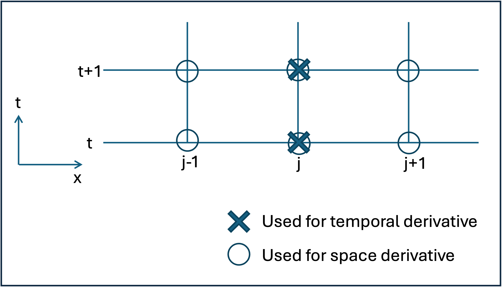
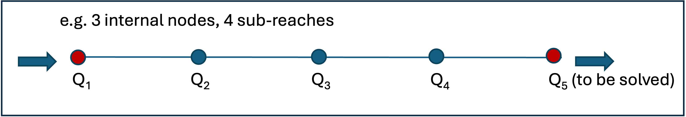

River routing methods
======================

mizuRoute include five different routing methods. The routing method(s) are applied to each river reach to compute outflow from the reach. The methods are Impulse response function, Lagrangian kinmatic wave, Euler kinematic wave, Muskingum Cunge, and Diffusive wave.
This section describe each method including numerical implementation.

A fundamental equations for river reach routing start with Saint-Venant equations that consists of two equations

.. math::
   :label: 0.1

   \frac{\partial Q }{\partial x} + \frac{\partial A }{\partial t} = q_{lat}

.. math::
   :label: 0.2

   \frac{\partial Q }{\partial t} + \frac{\partial }{\partial x}(\frac{Q^{2}}{A}) + gA\frac{\partial h }{\partial x} = gA(S_{0}-S_{f})

.. _Impulse_response_function:

Impulse response function
--------------------------

.. _Lagrangian_kinematic_wave:

Lagrangian kinmatic wave
--------------------------

.. _Euler_kinematic_wave:

Euler kinmatic wave
--------------------------

.. _Muskingum-Cunge:

Muskingum-Cunge
--------------------------

.. _Diffusive_wave:

Diffusive wave
--------------------------

If advection and inertia terms are neglected,  1-D Saint-Venant equation :eq:`0.1` and :eq:`0.2` is reduced to

.. math::
   :label: 5.1

   \frac{\partial Q }{\partial t} + C\frac{\partial Q}{\partial x} = D\frac{\partial^2 Q}{\partial^2 x}

.. math::
   :label: 5.2

   C = \frac{1}{K}\frac{\partial K}{\partial A}

.. math::
   :label: 5.3

   D = \frac{K^2}{2Qw}

.. math::
   :label: 5.4

   K = \frac{A}{n}R^{\frac{2}{3}}

where Eq. :eq:`5.2` is wave cerlerity [m/s], Eq. :eq:`5.3` is a wave diffusivity [m\ :sup:`2`\/s], and Eq. :eq:`5.4` is a channel conveyance.

To solve the diffusive wave equation for discharge Q, Eq. :eq:`5.1` is discretized using weighted averaged finite-difference approximations across two time steps in space
(Figure 1; i.e., second-order central difference in the RHS of :eq:`5.1` and first-order central difference for the second term of the LHS of :eq:`5.1`).

.. _Figure diffusive wave numerical discretization:

 Space and time discretization used for numerical solution of diffusive wave equation

The resulting discretized diffusive wave equation becomes:

.. math::
   :label: 5.5

   \frac{Q_{j}^{t+1} - Q_{j}^{t}}{\Delta t} + \frac{C}{2 \Delta x} \cdot ((1- \alpha )(Q_{j+1}^{t} - Q_{j-1}^{t})+ \alpha (Q_{j+1}^{t+1} - Q_{j-1}^{t+1})) = \\\\
   D \cdot (\frac{(1- \beta)(Q_{j+1}^{t} - 2Q_{j}^{t} + Q_{j-1}^{t})}{(\Delta x)^2} + \frac{\beta (Q_{j+1}^{t+1} - 2Q_{j}^{t+1} +Q_{j-1}^{t+1})}{(\Delta x)^2})

Rearranging Eq. :eq:`5.5` to:

.. math::
   :label: 5.6

   ( \alpha C_{a} - 2 \beta C_{d}) \cdot Q_{j+1}^{t+1} + (2+4 \beta C_{d}) \cdot Q_{j}^{t+1} - ( \alpha C_{a} + 2 \beta C_{d}) \cdot Q_{j-1}^{t+1} = \\\\
   -[(1- \alpha )C_{d} - 2(1- \beta )C_{d})] \cdot Q_{j+1}^{t} \\\\
   + [2-4(1- \beta )C_{d}] \cdot Q_{j}^{t} \\\\
   + [(1- \alpha )C_{a} + 2(1- \beta )C_{d})] \cdot Q_{j-1}^{t} \\\\

   C_{a} = \frac{C \Delta t}{ \Delta x}, C_{d} = \frac{D \Delta t}{( \Delta x)^{2}}

where :math:`\alpha` is the weight factor for the first-order space difference approximation of the second term of the LHS of :eq:`5.1`, and :math:`\beta` is a weight factor for the second-order space difference approximation in RHS of :eq:`5.1`.
If both weights are set to 1, the finite difference becomes a fully implicit scheme, while setting both weights to zero results in a fully explicit scheme. For default, mizuRoute uses a fully implicit finite-difference approximation (i.e., :math:`\alpha` = :math:`\beta` = 1).
Note that celerity (C) and diffusivity (D) include Q, which means the diffusive equation is actually non-linear. Here celerity (C) and diffusivity (D) are updated at every time step based on the discharges (Q) and flow area (A) at previous time step to liearize the diffusive equation.
Note that IRF routing is also based on diffusve equation. a major difference is that in IRF routing, celerity and diffusivity are provided as model parameters and constant in time, though they can be spatially distributed.

To apply the numerical solution of discretized diffusive wave equation for each reach, the internal nodes need to be defined within each reach.
The number of internal node is now hard-coded as 5 (in future, this will be made available as a control variable so that the number of the internal nodes can bespecified by a user via a control file.

:eq:`5.6` can be written as a system of linear equations that can be expressed in tridiagonal matrix form, :math:`A \cdot Q=b`, which can be solved with  with the Thomas' algorithm.

.. _Figure 4 internal nodes in a reach:

 An example of 4 internal nodes per reach.

For example, with 4 internal nodes as shown in, the matrix form of the equations are written as:

.. math::
   :label: 5.8

   \small A=
   \left[ \begin {array}{cccc}
   1&0&0&0&0\cr
   -(\alpha C_{d}+2\beta C_{d})&2+4\beta C_{d}&\alpha C_{a}-2\beta C_{d}&0&0\cr
   0&-(\alpha C_{d}+2\beta C_{d})&2+4\beta C_{d}&\alpha C_{a}-2\beta C_{d}&0\cr
   0&0&-(\alpha C_{d}+2\beta C_{d})&2+4\beta C_{d}&\alpha C_{a}-2\beta C_{d}\cr
   0&0&0&-1&1
   \end {array} \right]

.. math::
   :label: 5.7

   \small Q=
   \left[ \begin {array}{c}
   Q_{1}^{t+1} \cr
   Q_{2}^{t+1} \cr
   Q_{3}^{t+1} \cr
   Q_{4}^{t+1} \cr
   Q_{5}^{t+1}
   \end {array} \right]

.. math::
   :label: 5.9

   \small b=
   \left[ \begin {array}{c}
   Q_{1}^{t+1} \cr
   ((1-\alpha)C_{a} + 2(1-\beta)C_{d}) \cdot Q_{1}^{t} + (2-4(1-\beta)C_{d}) \cdot Q_{2}^{t} - ((1-\alpha)C_{a}-2(1-\beta)C_{d}) \cdot Q_{3}^{t} \cr
   ((1-\alpha)C_{a} + 2(1-\beta)C_{d}) \cdot Q_{2}^{t} + (2-4(1-\beta)C_{d}) \cdot Q_{3}^{t} - ((1-\alpha)C_{a}-2(1-\beta)C_{d}) \cdot Q_{4}^{t} \cr
   ((1-\alpha)C_{a} + 2(1-\beta)C_{d}) \cdot Q_{3}^{t} + (2-4(1-\beta)C_{d}) \cdot Q_{4}^{t} - ((1-\alpha)C_{a}-2(1-\beta)C_{d}) \cdot Q_{5}^{t} \cr
   a \cdot dx
   \end {array} \right]

The top row of the system of equations is upstream boundary conditions, which is inflow from upstream reaches (i.e., Dirichlet boundary condition).
The Bottom row of the system of equations is downstream boundary condition.
Here, Neumann boundary condition, which specifies the gradient of discharge between two adjacent nodes at the downstream end, is used.
Neumann boundary condition at the downstream end is written by:

.. math::
   :label: 5.10

   \frac{\partial Q}{\partial x}\Big{|}_{x=5}

which is discretized as :math:`Q_{5}^{t+1} - Q_{4}^{t+1} = a \cdot dx`. The gradient at downstream end :math:`a` is approximated by the Q computed at the nodes at previous time step.

