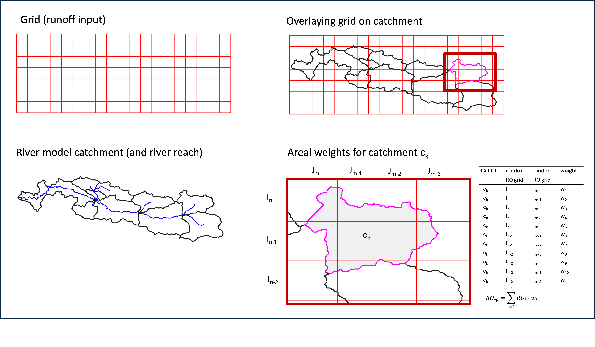

.. _Input_files:

=================
Input files
=================

For routing runoff throughout the river network without any lakes, mizuRoute expects several input data depending on how runoff data is provided.
For advanced features such as lake, water management, solute transport, simple data assimilation, please refer to xxx for additional input data.
This section describe input data required for river routing without those advanced features.

All the input data (except for a fews - gauge meta and spatially constant parameter namelist) is in netCDF (any netCDF formats such as ``classic``, ``64-bit offset``, ``CDF5``, or ``netCDF-4``).
Basic netCDF requirements (variable, dimension, attributes etc) are discussed below.
Dimension and variable names have default names but can be whatever.
If the default names are not used, the user is required to specify them in the control file. If the default names as specified in the tables are used in the netCDF, there is no need to speciy them in the control file.

.. _River_network_data:

River data file (required)
--------------------------

River netCDF data holds river reach-reach topology, reach-hru topology, and river reach and HRU physical parameters.

With minimum topological parameters (``downSegId`` and ``hruSegId``), mizuRoute computes additional river network topological parameters necessary to efficiently navigate the computations through river network from upstream to downstream.
MizuRoute also requires minimum physical parameters of reach and HRU (``length`` and ``slope`` for reach and ``area`` for HRU).
With minimum physical parameters, mizuRoute compute bottom width and bankful depth for each reach with simple functions and uses default values for the other parameters.
For additional reach physical parameters, please see :ref:`full list of river physical parameters <channel_physical_parameters>`

The tables below dimensions and variables in the river data netCDF with minimum requirement, and control keys used in the control file to specify the variable/dimension names if the names are not same as the defaults.

.. list-table:: Control keys for dimensions used in river netCDF
   :header-rows: 1
   :widths: 20 20 10 30
   :name: River data dimensions

   * - Control key
     - Type
     - default name
     - Description
   * - ``<dname_sseg>``
     - NetCDF dimension name
     - seg
     - Dimension name for river reach variables
   * - ``<dname_nhru>``
     - NetCDF dimension name
     - hru
     - Dimension name for HRU variables

.. list-table:: Control keys for river and HRU variables
   :header-rows: 1
   :widths: 20 20 20 10 10 10 30
   :name: River data variables

   * - Control key
     - Type
     - default name
     - Variable type
     - dimension(s)
     - unit
     - Description
   * - ``<varname_segId>``
     - NetCDF variable name
     - segId
     - int
     - seg
     - ``-``
     - reach ID
   * - ``<varname_downSegId>``
     - NetCDF variable name
     - downSegId
     - int
     - seg
     - ``-``
     - id of the downstream reach
   * - ``<varname_hruSegId>``
     - NetCDF variable name
     - hruSegId
     - int
     - hru
     - ``-``
     - id of the reach the HRU flows into
   * - ``<varname_HRUid>``
     - NetCDF variable name
     - HRUid
     - int
     - hru
     - ``-``
     - id of HRU
   * - ``<varname_length>``
     - NetCDF variable name
     - length
     - real
     - seg
     - ``m``
     - reach length
   * - ``<varname_slope>``
     - NetCDF variable name
     - slope
     - real
     - seg
     - ``m/m``
     - reach slope (elevation drop/length)
   * - ``<varname_area>``
     - NetCDF variable name
     - area
     - real
     - hru
     - ``m^2``
     - HRU area

Negative or zero (<=0) value for downSegId and hruSegId is reserved for no downstream reach, meaning that such reach or hru does not flow into any reach (i.e., basin outlet or closed HRU).
For this reason, segId is required to use positive integer value. Currently no string ID is allowed, but integer type can be either 32bit or 64bit (long integer)

The user has an option to provide all the topological variables from the netCDF, though it is recommended that river network topology is built within mizuRoute instead of computing outside.
To use the topological parameters from the netCDF, make sure that the key ``<topoNetworkOption>`` is included in the control file and **must be set to 0**. The default values is ``1`` (compute topological parameters internally).

.. list-table:: Control key to channel topological parameter specification
   :header-rows: 1
   :widths: 20 15 15 50
   :name: topological-parameter-specification

   * - Control key
     - Type
     - Default
     - Description
   * - ``<topoNetworOption>``
     - int
     - ``1``
     - Options for network topological parameters estimations

       * ``0`` → read from a river input data
       * ``1`` → compute internally

The channel physical parameters are ideally provided per reach from the netCDF. See :ref:`full list of river physical parameters <channel_physical_parameters>` for the instruction of how to enable reading option for physical parameters.

.. _Runoff_data:

Runoff file(s) (required)
-------------------------

There are three cases for spatial configurations of runoff data:

* Option 1. runoff is given at each river network HRU
* Option 2. runoff is given at each hydrologic model HRU (non-grid)
* Option 3. runoff is given at grid

For options 2 and 3, mizuRoute needs to remap runoff at hydrologic model HRU or grid to river network HRU with areal weight averaging.
In this case, remapping data is required. See :ref:`remapping data <Runoff_mapping_data>`.

Requirement of control keys for runoff netCDF information depends on the options as bellow.

**Option 1 river network HRU mean runoff:**

.. list-table:: Control keys for dimensions used in runoff netCDF (option 1)
   :header-rows: 1
   :widths: 20 20 10 30
   :name: runoff data dimensions for option 1

   * - Control key
     - Type
     - default name
     - Description
   * - ``<dname_time>``
     - NetCDF dimension name
     - time
     - Dimension name for datetime
   * - ``<dname_hruid>``
     - NetCDF dimension name
     - hru
     - Dimension name for river network's HRU

.. list-table:: Control keys for variables in runoff netCDF (option 1)
   :header-rows: 1
   :widths: 20 20 20 10 20 20 30
   :name: runoff data variables for option 1

   * - Control key
     - Type
     - default name
     - Variable type
     - dimension(s)
     - unit
     - Description

   * - ``<vname_time>``
     - NetCDF variable name
     - time
     - real
     - time
     - [time-unit] since yyy-mm-dd 00:00:00
     - name of time variable

   * - ``<vname_hruid>``
     - NetCDF variable name
     - hru
     - int
     - hru
     - ``-``
     - name of river network HRU

   * - ``<vname_qsim>``
     - NetCDF variable name
     - runoff
     - real
     - time, hru
     - ``[length-unit]/[time-unit]``
     - name of river network HRU mean runoff variable

**Option 2 hydrologic model HRU mean runoff:**

.. list-table:: Control keys for dimensions used in runoff netCDF (option 2)
   :header-rows: 1
   :widths: 20 20 10 30
   :name: runoff data dimensions for option 2

   * - Control key
     - Type
     - default name
     - Description
   * - ``<dname_time>``
     - NetCDF dimension name
     - time
     - Dimension name for datetime
   * - ``<dname_hruid>``
     - NetCDF dimension name
     - hru
     - Dimension name for hydrologic model HRU

.. list-table:: Control keys for variables in runoff netCDF (option 2)
   :header-rows: 1
   :widths: 20 20 20 10 20 20 30
   :name: runoff data variables for option 2

   * - Control key
     - Type
     - default name
     - Variable type
     - dimension(s)
     - unit
     - Description

   * - ``<vname_time>``
     - NetCDF variable name
     - time
     - real
     - time
     - ``[time-unit] since yyy-mm-dd 00:00:00``
     - name of time variable

   * - ``<vname_vname_hruid>``
     - NetCDF variable name
     - hru
     - int
     - hru
     - ``-``
     - name of hydrologic model HRU

   * - ``<vname_qsim>``
     - NetCDF variable name
     - runoff
     - real
     - time, hru
     - ``[length-unit]/[time-unit]``
     - name of hydrologic model HRU mean runoff variable

**Option 3 gridded runoff:**

.. list-table:: Control keys for dimensions used in runoff netCDF (option 3)
   :header-rows: 1
   :widths: 20 20 10 30
   :name: runoff data dimensions for option 3

   * - Control key
     - Type
     - default name
     - Description
   * - ``<dname_time>``
     - NetCDF dimension name
     - time
     - Dimension name for datetime
   * - ``<dname_xlon>``
     - NetCDF dimension name
     - lon
     - Dimension name for x (horizontal) direction grid
   * - ``<dname_ylat>``
     - NetCDF dimension name
     - lat
     - Dimension name for y (vertical) direction of grid

.. list-table:: Control keys for variables in runoff netCDF (option 3)
   :header-rows: 1
   :widths: 20 20 20 10 20 20 30
   :name: runoff data variables for option 3

   * - Control key
     - Type
     - default name
     - Variable type
     - dimension(s)
     - unit
     - Description

   * - ``<vname_time>``
     - NetCDF variable name
     - time
     - real
     - time
     - [time-unit] since yyy-mm-dd 00:00:00
     - name of time variable

   * - ``<vname_qsim>``
     - NetCDF variable name
     - runoff
     - real
     - time, lon, lat
     - [length-unit]/[time-unit]
     - name of gridded runoff variable

Attributes: Time variable needs two attributes- *units* and *calendar*. Four types of calendar are allowed. These are ``noleap``, ``standard``, ``gregorian``, and ``proleptic_gregorian``.
Time unit format is shown in the table. Runoff variable needs *units*, as shown in the table. ``m`` or ``mm`` is allowed for ``length-unit``, while ``s``, ``h`` or ``day`` is allowed for ``time-unit``.

.. _Runoff_mapping_data:

Runoff remapping file (required for runoff input option 2 and 3)
-----------------------------------------------------------------

MizuRoute has a capability to remap runoff at different HRU (i.e., hydrologic model HRU - option 2 runoff data) or grid (option 3 runoff data) to HRU defined in river network using areal weighted average.
The user is required to provide a mapping file in netCDF.
If runoff is provided at each river network HRU (option 1 runoff data) no mapping data is required.

To activate remapping capablilty, the user needs to include the two control keys in the control file:

.. list-table:: Control keys on remapping
   :header-rows: 1
   :widths: 20 15 15 50
   :name: remapping

   * - Control key
     - Type
     - Default
     - Description
   * - ``<is_remap>``
     - logical
     - F
     - Logical to indicate runoff needs to be remapped to river network HRU. Set T to activate remapping option
   * - ``<fname_remap>``
     - char
     - None
     - Name of remapping netCDF

Both runoff input option 3 (vector runoff) and option 3 (gridded runoff) have common dimensions for mapping files.

.. list-table:: Control keys for dimensions used in mapping netCDF (option 2 and 3)
   :header-rows: 1
   :widths: 20 20 10 30
   :name: runoff data dimensions for option 2 and 3

   * - Control key
     - Type
     - default name
     - Description
   * - ``<dname_hru_remap>``
     - NetCDF dimension name
     - polyid
     - Dimension corresponding to river network HRU
   * - ``<dname_data_remap>``
     - NetCDF dimension name
     - data
     - Dimension corresponding to concatnenated overlapping HRU or grid boxes

However, hydrologic model HRU runoff and gridded runoff requires a different set of remapping variables, as shown in talbes below.

**Option 2 hydrologic model HRU mean runoff:**

.. list-table:: Control keys for variables in remapping netCDF (option 2)
   :header-rows: 1
   :widths: 20 20 20 10 20 30
   :name: remapping data variables for option 2

   * - Control key
     - Type
     - default name
     - Variable type
     - dimension(s)
     - Description of variable

   * - ``<vname_hruid_in_remap>``
     - NetCDF variable name
     - polyid
     - int
     - polyid
     - HRU Id corresponding to river network HRU

   * - ``<vname_num_qhru>``
     - NetCDF variable name
     - nOverlaps
     - int
     - polyid
     - count of overlapping hydrologic model HRUs per river network HRU

   * - ``<vname_weight>``
     - NetCDF variable name
     - weight
     - real
     - data
     - areal weight of overlapping hydrologic model HRUs

   * - ``<vname_qhruid>``
     - NetCDF variable name
     - overlapPolyId
     - int
     - data
     - HRU Id corresponding to Hydrologic model

**Option 3 gridded runoff:**

.. list-table:: Control keys for variables in remapping netCDF (option 3)
   :header-rows: 1
   :widths: 20 20 20 10 20 30
   :name: remapping data variables for option 3

   * - Control key
     - Type
     - default name
     - Variable type
     - dimension(s)
     - Description of variable
   * - ``<vname_hruid_in_remap>``
     - NetCDF variable name
     - polyId
     - int
     - polyid
     - HRU Id corresponding to river network HRU
   * - ``<vname_num_qhru>``
     - NetCDF variable name
     - nOverlaps
     - int
     - polyid
     - count of overlapping grid boxes per river network HRU
   * - ``<vname_weight>``
     - NetCDF variable name
     - weight
     - real
     - data
     - areal weight of overlapping grid boxes
   * - ``<vname_i_index>``
     - NetCDF variable name
     - i_index
     - int
     - data
     - x or longitudinal direction index of overlapping grid boxes (1 from left)
   * - ``<vname_j_index>``
     - NetCDF variable name
     - j_index
     - int
     - data
     - y or latitudinal direction index of overlapping grid boxes (1 from bottom)

Creating a mapping is basically GIS intersection of two geometries. The figure below visualizes intersection between runoff grid (option 3) and river network HRU polygons.
This example (right bottom) shows river network HRU, c\ :sub:`k`\, has 11 overlapping grid boxes (nOverlaps=11 in a mapping netCDF. see table above) and corresponding weights (i.e., fractions of each overlapped grid boxes to total area of c\ :sub:`k`\) as well as i_index and j_index.
In a mapping netCDF, all 1D arrays of weights (and i_index and j_index) from each grid box (or hydrologic model HRU) are combined for a large single 1D array. The order of the arrays from each HRU must match the order of river network HRU

There are a few tools available to create the netCDF with required data:

#. mizuRoute_remapping (https://github.com/ShervanGharari/mizuRoute_remapping)

.. _namelist_file:

Spatially-constant parameter namelist (required)
------------------------------------------------

For convinence purpose, the user can provide a spatially constant routing parameters in a namelist as below.
Manning coefficient and channel bottom width can be provided to individual reach through river data netCDF.
See :ref:`Channel physical parameters <channel_physical_parameters>` for instructions on how to provide the channel phsycal parameters for each reach.
See :ref:`river routing schemes <River_routing_schemes>` in Technical note for meaning of each parameters.
However, currently, assignment to IRF routing parameters and hillslope routing parameters to indivisual reaches and HRUs, respectively are not implemented. Therefore, this namelist is required currently.

::

     &HSLOPE
       ! gamma distribution parameters for hillslope routing
       fshape = 2.5    !  shape parameter (>0) [-]
       tscale = 86400  !  scale parameter [sec]
     /
     &IRF_UH
       ! Unit hydrograph derived from diffusive wave equation
       velo   = 1.5 ! wave celerity [m/s]
       diff   = 5000.0 ! diffusivity [m2/s]
     /
     &KWT
       ! channel physical parameter
       mann_n = 0.01    ! manning coefficient [-]
       wscale = 0.001   ! channel width parameter [-]: W=wclae*(Aups)**b where Aups=upstream area, b=0.5
     /

.. _Restart_file_input:

Restart file (optional)
-----------------------

By default, mizuRoute initializes channel states as *empty* when no restart file is provided. To perform a continuous simulation—where a run is stopped and later resumed from its previous endpoint—a restart must be provided (see the table below).
A restart file contains channel states from the time step immediately preceding the start of the resumed simulation.

Restart netCDF files are not written by default. To enable restart output, the user must spefiy several control keys listed in the table beflow.
Restart files are named using the convention ``<case_name>.r.<restart_datetime>.nc``, where ``<restart_datetime>`` represents the start datetime of the next simulation
(NOT the datetime at which the restart file is written), formatted as ``yyyy-mm-dd-sssss``. The ``sssss`` field denotes seconds since midnight, e.g., 43200 second = 12:00:00.

If a user examines the restart netCDf, it should be noticed that state variables in the restart netCDF correspond to the time step immediately preceding ``<restart_datetime>``
For example, in hourly simulation, the file ``<case_name>.r.1981-01-01-00000.nc`` should contain the states at ``1980-12-31 23:00:00``.
Restart netCDF may be used to initialize simulations at arbitary datetime, e.g., *warmed-up river states*, but are primarily intended for continuous simulations.

The timing of restart file output is controlled by the control key ``<restart_write>`` (see the table below).
For periodic restart output (``yearly``, ``monthly``, or ``daily``), the user may specify the month, day, and hour at which restart files are written.
For example, with yearly output,  2 for ``<restart_mon>``, 4 for ``<restart_day>``, and 11 for ``<restart_hour>``, a restart file are written each year on February 4th at 11:00:00.
For ``<restart_hour>`` to take effec, the simulation time step (``<dt_qsim>``) must evenly divided the specified ``<restart_hour>`` in second within a day.

.. list-table:: Control keys on restart I/O
   :header-rows: 1
   :widths: 20 15 15 50
   :name: restart I/O

   * - Control key
     - Type
     - Default
     - Description
   * - ``<restart_write>``
     - char
     - ``never``
     - restart write option (case-insensitive).

       * ``never`` → no restart file written
       * ``last`` → restart written at very end of time step
       * ``specified`` → restart written at speficied time stamp
       * ``yearly`` → restart written every year
       * ``monthly`` → restart written every month
       * ``daily`` → restart written every day
   * - ``<restart_dir>``
     - char
     - The same as <output_dir>
     - Directory where restart netCDFs are output and also restar file to be read is located.
   * - ``<restart_date>``
     - char
     - None
     - restart datetime in yyyy-mm-dd (hh:mm:ss) format. Effective with ``Specified`` option
   * - ``<restart_month>``
     - int
     - 1
     - month used for periodic restart output. Effective with ``yearly`` option
   * - ``<restart_day>``
     - int
     - 1
     - day used for periodic restart output. Effective with ``yearly`` and ``monthly`` options
   * - ``<restart_hour>``
     - int
     - 0
     - hour used for periodic restart output. Effective with ``yearly``, ``monthly`` and ``daily`` options
   * - ``<fname_state_in>``
     - char
     - None
     - Name of restart netCDF to be used for initialization. If not specified, simulation start with cold start.

.. _WaterManagement_file:

Water management file (optional)
--------------------------------

.. _GaugeData_file:

Gauge data file (optional)
--------------------------

mizuRoute can read gauge meta ascii data.
Gauge meta ascii file is in csv format, and should include at least gauge id and corresponding reach id.
With gauge metadata provided, a user can output the simulation only at gauge, in addition to at the entire river network.

To read and use gauge metadata, the following control variables need to be specified.

.. list-table:: Control keys on gauge metadata
   :header-rows: 1
   :widths: 20 15 15 50
   :name: gauge metadata

   * - Control key
     - Type
     - Default
     - Description
   * - ``<gageMetaFile>``
     - char
     - None
     - name of gage meta csv file including two columns : gauge_id (non-numeric ID is accepted), seg_id
   * - ``<outputAtGage>``
     - logical
     - F
     - logical value (T or F) to output history variable at gauged reaches.
   * - ``<strlen_gageSite>``
     - int
     - 30
     - maximum gauge name string length

In addition to the gauge metadata, gauge discharge data (netCDF) can be read to modify discharge whenever/wherever observed discharge is available.

.. list-table:: Control keys on gauge observed discharge data
   :header-rows: 1
   :widths: 20 15 15 50
   :name: gauge observed discharge data

   * - Control key
     - Type
     - Default
     - Description
   * - ``<fname_gageObs>``
     - char
     - None
     - name of gauge discharge netCDF

The observed discharge data is stored in netCDF and specifications are given in the control files as below.

.. list-table:: Control keys for dimensions used in observed flow netCDF
   :header-rows: 1
   :widths: 20 20 10 30
   :name: Dimension in observed flow netCDF

   * - Control key
     - Type
     - default name
     - Description
   * - ``<dname_gageTime>``
     - NetCDF dimension name
     - time
     - Dimension name for time variables
   * - ``<dname_gageSite>``
     - NetCDF dimension name
     - site
     - Dimension name for site

.. list-table:: Control keys for variables in observed flow netCDF
   :header-rows: 1
   :widths: 20 20 20 10 20 30
   :name: Variables in observed flow netCDF

   * - Control key
     - Type
     - default name
     - Variable type
     - dimension(s)
     - Description of variable

   * - ``<vname_gageFlow>``
     - NetCDF variable name
     - flow
     - real
     - time,site
     - Observed flow [m3/s] at gauge
   * - ``<vname_gageTime>``
     - NetCDF variable name
     - time
     - float
     - time
     - time variable in a unit of <time_unit> since yyyy-mm-dd hh:mm:ss
   * - ``<vname_gageSite>``
     - NetCDF variable name
     - site
     - char
     - site
     - guage site name (character array)

Currently, direct insertion, the simplest data assimilation, is implemented as an experiment.
Direct insertion can be performed at a list of reaches in the metadata. Two parameters, ``<QerrTrend>`` and ``<ntsQmodStop>``, are needed.
``<QerrTrend>`` tells how bias computed at observation time at each reach evolves in the subsequent future ``<ntsQmodStop>`` time steps.
The evolution of the bias is computed only at time step when observation get unavailable.

To activate direct insertion of observed discharge into simulated discharge, the following control variables need to be specified.

+---------------------+---------------------------------------------------------------------------------------------------------+
| control variable    | Description                                                                                             |
+=====================+=========================================================================================================+
| <qmodOption>        | activation of direct insertion. 0 -> do nothing, 1=> discharge direct insertion                         |
+---------------------+---------------------------------------------------------------------------------------------------------+
| <ntsQmodStop>       | the number of time steps when flow correction stops                                                     |
+---------------------+---------------------------------------------------------------------------------------------------------+
| <QerrTrend>         | temporal discharge error trend. 1->constant, 2->linear, 3->logistic, 4->exponential                     |
+---------------------+---------------------------------------------------------------------------------------------------------+
