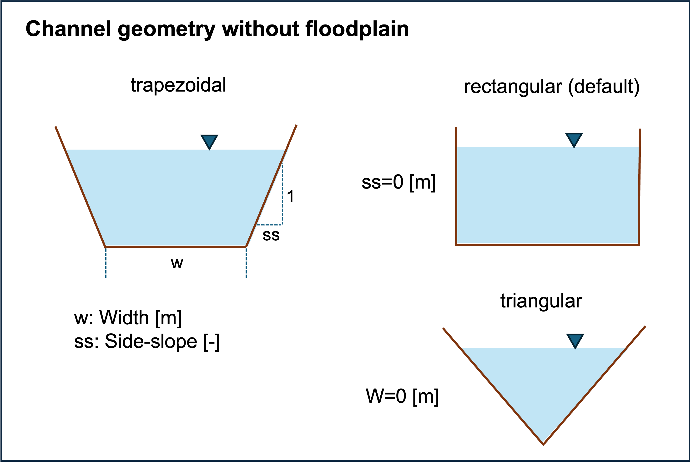
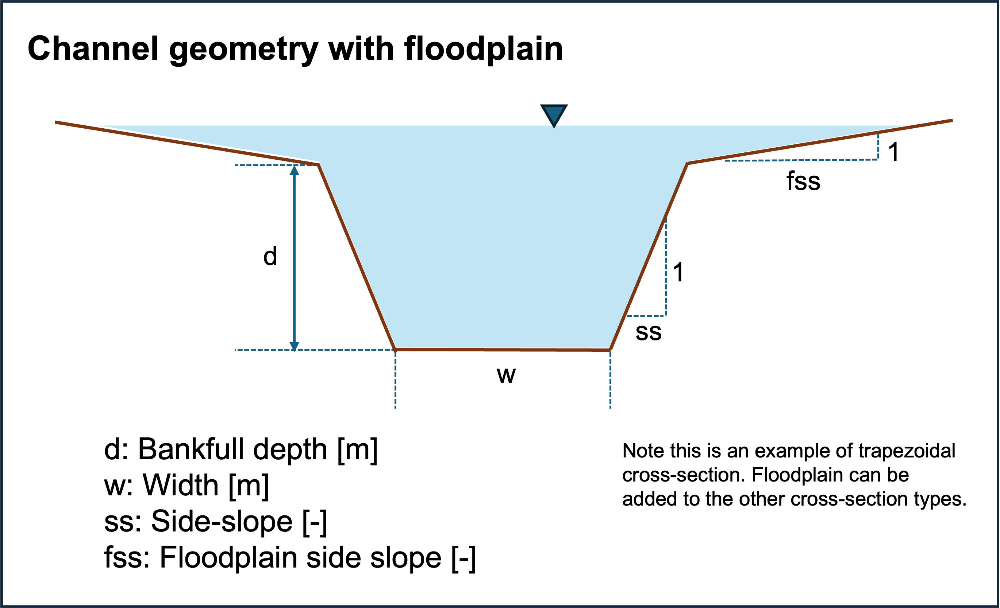
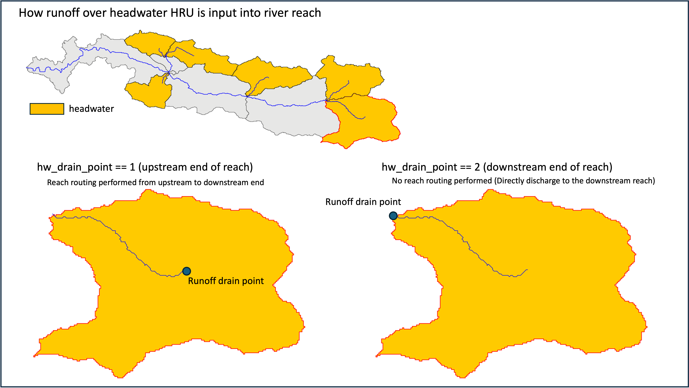

.. _River_routing_config:

River or In-Channel Routing Models
==================================

MizuRoute has five channel routing schemes:

1. Impulse response function (IRF)
2. Lagrangian kinematic wave (LKW)
3. Euler kinematic wave (KW)
4. Muskingum-Cunge (MC)
5. Diffusive Wave (DW)

Please see :ref:`River routing schemes <River_routing_schemes>` for more information on methods and numerical solutions of each method.
Additionally, mizuRoute has an option to compute accumulated runoff [m3/s] without any channel routing at any outlets of river reaches, if a user wants to get total runoff volume of upstream areas.

Currently, a user must provide the control key ``<routOpt>`` to select which routing option(s) to be used. ``<routOpt>`` is an integer that corresponds to the routing schemes (IRF=1, LKW=2, KW=3, MC=4, DW=5). Runoff accumulation option uses ``0``.
A user can run multiple routing schemes at the same time by setting ``<routOpt>`` to multiple IDs. For example, if a user wants to use runoff accumulation, KW, and DW, ``<routOpt>`` should be ``035``.

.. _channel_physical_parameters:

Channel physical parameters
---------------------------

IRF requires two parameters (wave celerity and diffusivity) along with **slope** and **length**, used to compute unit-hydrograph, while the other schemes uses a few channel physical parameters in addition to **slope** and **length**.
Regardless of the routing schemes, **slope** and **length** are the minimum channel physical parameters that must be included in a river input data See :ref:`River input data <River_network_data>`.
If users uses minimum set of channel physical parameters, mizuRoute will compute all the channel physical parameters using spatially constant parameter specified in the namelist.
To setup spatially distributed river channel parameters, a user can provide channel physical parameters at each river reach in river input data.

To use the channel parameters from the netCDF, make sure that the key ``<hydGeometryOption>`` in the control file **must be set to 0**. The default values is ``1`` (compute channel parameter internally).

As a default, a river channel does not have floodplains, meaning river water is always contained in a channel.
A user can add a simple, hypothetical floodplain by adding the control key ``<floodplain>`` with ``T``. By adding floodplain, discharge tends to be attenuated due to greater water-riverbed contact area.
For active floodplain option, the channel bankfull depth needs to be computed as a default, or supplied in the river input netCDF.
Also, by adding floodplain, water storage over floodplain is computed in addition to total water storage, which may be used for furter flood mapping (outside mizuRoute) or feedback to the land model (for CESM coupled mode)
Note that currently floodplain is activate only for KW, MC, and DW routing schemes.

How the physical parameters control the shape of the channel cross-section of the channel without and with floodplain is depicted below:

Below is the control keys related to the option of channel geometry specification.

.. list-table:: Control key to method channel physical parameter specification
   :header-rows: 1
   :widths: 20 15 15 50
   :name: channel-parameter-specification

   * - Control key
     - Type
     - Default
     - Description
   * - ``<hydGeometryOption>``
     - int
     - ``1``
     - Options for channel physical parameters estimations

       * ``0`` → read from a river input data
       * ``1`` → compute internally
   * - ``<floodplain>``
     - logical
     - ``F``
     - Options to add a simple floodplain

       * ``F`` → no floodplain, channel is unlimited bank depth
       * ``T`` → add floodplain, and floodwater volume is computed

Then, a user needs to specify the variable name related channel physical properties in the control file.

.. list-table:: channel routing related control keys in the river input file
   :widths: 20 20 15 15 15 15 30
   :header-rows: 1
   :name: channel-parameter-variables

   * - Control key
     - Type
     - Variable type
     - Variable dimension
     - Variable unit
     - routing schemes
     - Description
   * - ``<varname_width>``
     - NetCDF variable name
     - real
     - seg
     - m
     - KWT, KW, MC, DW
     - channel bottom width
   * - ``<varname_man_n>``
     - NetCDF variable name
     - real
     - seg
     - \-
     - KWT, KW, MC, DW
     - manning n coefficient
   * - ``<varname_sideSlope>``
     - NetCDF variable name
     - real
     - seg
     - \-
     - KWT, KW, MC, DW
     - channel side slope. vertical:horisontal=1:sideSlope
   * - ``<varname_depth>``
     - NetCDF variable name
     - real
     - seg
     - m
     - KWT, KW, MC, DW
     - channel bankful depth for active floodplain

.. _Miscleneous_control_keys:

Miscleneous control keys
------------------------

There are few miscleneous control keys available for a channel routing. Note that these are not implemented to all the routing schemes.

.. list-table:: Miscleneous channel routing related control keys
   :widths: 20 15 15 15 50
   :header-rows: 1
   :name: Miscleneous channel routing control keys

   * - Control key
     - Type
     - Default
     - routing schemes
     - Description
   * - ``<min_length_route>``
     - real
     - 0.0
     - IRF, KW, MC, DW
     - minimum reach length [m] for routing to be performed. pass-through (outflow=infolw+local flow) is performed for length less than this threshold.
   * - ``<hw_drain_point>``
     - int
     - 2
     - IRF, KW, MC, DW
     - how to add local runoff in a reach of headwater HRUs.
       * ``1`` → top of reach
       * ``2`` → bottom of reach (default)

For ``hw_drain_point``, see the image below for the concept of how runoff is drained into a headwater reach: Note that non-headwater reaches recieve runoff at the downstream end.

.. _Figure_hw_drain_method:

 Schematics of how runoff is input into a headwater reach.

